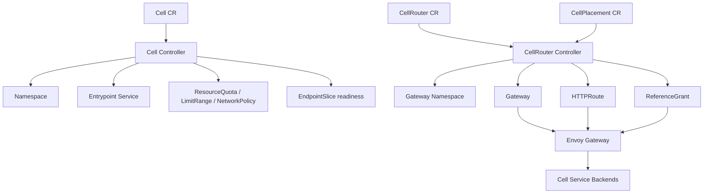

# Cell Router Operator

`cell-router-operator` is a Kubernetes operator built with Go and Kubebuilder for experimenting with cell-based routing on Kubernetes using Gateway API resources.

It manages three cluster-scoped custom resources:

- `Cell`: owns the service boundary of a cell, including its namespace, entrypoint `Service`, backend readiness, and optional namespace policies.
- `CellRouter`: owns the routing boundary, including a `Gateway`, `HTTPRoute` resources, and required `ReferenceGrant` objects.
- `CellPlacement`: declares reusable tenant or partition routing rules that a `CellRouter` materializes into additional `HTTPRoute` resources.

The project is designed for local validation with Kind + Envoy Gateway and for extension into a richer cell-routing control plane.

## Cell-Based Architecture

Cell-based architecture is a bulkhead-style design approach: instead of running one large shared instance of a workload, you split the workload into multiple isolated instances called cells. Each cell handles only a subset of traffic, and failures should stay contained to the cell currently serving the affected requests.

In the AWS Well-Architected guidance, the important properties are:

- cells are independent workload instances
- cells should avoid sharing state with each other
- a routing layer sends requests to the correct cell
- the routing layer should stay as thin as possible
- the main goal is reducing the scope of impact when a failure, bad deployment, or poison-pill request happens

This repository maps those ideas to Kubernetes in a deliberately small but functional form:

- a `Cell` represents one isolated workload boundary
- a `CellRouter` represents the shared routing layer in front of cells
- a `CellPlacement` models tenant or partition mapping without baking that logic directly into every route
- Gateway API provides the routing contract
- Envoy Gateway is used locally as the Gateway API implementation

This is still not a complete platform. It does not implement automated balancing, migration orchestration, or multi-cluster control planes. What it does provide is a working foundation for:

- isolated cell entrypoints
- routing to one or more traffic-ready cells
- cell lifecycle states such as `Active`, `Draining`, and `Disabled`
- simple namespace-scoped cell policies
- reusable placement rules
- local end-to-end validation with real HTTP traffic

## What It Does

At a high level:

1. A `Cell` declares where a workload lives and how it should be exposed internally.
2. The operator creates the cell namespace and entrypoint `Service`.
3. The operator marks the cell `Ready` only when the entrypoint has ready backend endpoints.
4. Optional namespace policies such as `ResourceQuota`, `LimitRange`, and `NetworkPolicy` can be reconciled with the cell.
5. A `CellRouter` declares explicit routes and gateway configuration.
6. `CellPlacement` resources add reusable routing rules that resolve to one or more cells.
7. The operator creates a `Gateway`, `HTTPRoute` resources, and cross-namespace `ReferenceGrant` objects.
8. Traffic is routed according to hostname, path, headers, query params, weights, lifecycle state, and fallback behavior.

## Architecture



## Requirements

For the local end-to-end flow:

- Docker
- Kind
- kubectl
- Helm

For host-side development:

- Go 1.25.3
- Kubebuilder 4.13.1

## Run Locally

Use the local script:

```bash
./scripts/run-local.sh
```

The script does the following:

1. Ensures a Kind cluster exists.
2. Installs Gateway API CRDs.
3. Cleans up stale local Envoy Gateway resources when needed.
4. Installs Envoy Gateway via Helm.
5. Applies the local `GatewayClass`.
6. Labels the Envoy Gateway namespace so the sample `NetworkPolicy` allows traffic from it.
7. Runs unit tests with coverage.
8. Builds the operator image.
9. Loads the image into Kind.
10. Installs CRDs and deploys the controller.
11. Applies two sample cells: `payments-cell-1` and `payments-cell-2`.
12. Deploys two sample workloads.
13. Verifies that cells become traffic-ready.
14. Verifies sample namespace policies.
15. Applies the sample `CellRouter` and sample `CellPlacement` resources.
16. Verifies routing with real `curl` requests for direct routes and tenant placement rules.

## Local Verification

The sample resources exercise two categories of behavior:

- direct routing:
  - `payments.example.com` + `/payments/cell-1` -> `payments-cell-1`
  - `payments.example.com` + `/payments/cell-2` -> `payments-cell-2`
- placement routing:
  - `payments.example.com` + `X-Tenant: tenant-a` + `/tenant` -> `payments-cell-1`
  - `payments.example.com` + `X-Tenant: tenant-b` + `/tenant` -> `payments-cell-2`

Useful commands after the script:

```bash
kubectl get cells
kubectl get cellplacements
kubectl get cellrouters
kubectl get gateways -A
kubectl get httproutes -A
kubectl get referencegrants -A
```

Manual verification example:

```bash
ENVOY_SERVICE=$(kubectl get svc -n envoy-gateway-system \
  --selector=gateway.envoyproxy.io/owning-gateway-namespace=cell-router-system,gateway.envoyproxy.io/owning-gateway-name=cell-router-gateway \
  -o jsonpath='{.items[0].metadata.name}')

kubectl -n envoy-gateway-system port-forward service/${ENVOY_SERVICE} 8888:80
```

In another terminal:

```bash
curl -H 'Host: payments.example.com' \
  'http://127.0.0.1:8888/payments/cell-1'

curl -H 'Host: payments.example.com' \
  'http://127.0.0.1:8888/payments/cell-2'

curl -H 'Host: payments.example.com' -H 'X-Tenant: tenant-a' \
  'http://127.0.0.1:8888/tenant'

curl -H 'Host: payments.example.com' -H 'X-Tenant: tenant-b' \
  'http://127.0.0.1:8888/tenant'

```

Expected behavior:

- `payments-cell-1-route` returns `payments cell 1 backend`
- `payments-cell-2-route` returns `payments cell 2 backend`
- `tenant-a-placement` returns `payments cell 1 backend`
- `tenant-b-placement` returns `payments cell 2 backend`

## Tests

Run the full test suite:

```bash
go test ./...
```

Run the focused core suite with coverage:

```bash
go test ./api/... ./internal/... -coverprofile=coverage.out
go tool cover -func=coverage.out | tail -n1
```

The current suite covers:

- API deep-copy behavior
- `Cell` reconciliation
- `CellRouter` reconciliation
- traffic-readiness logic
- `CellPlacement` materialization
- fallback behavior
- Namespace, Service, Gateway, HTTPRoute, and `ReferenceGrant` builders
- metadata merge helpers

## Main Custom Resources

### Cell

```yaml
apiVersion: cell.cellrouter.io/v1alpha1
kind: Cell
metadata:
  name: payments-cell-1
spec:
  state: Active
  workloadSelector:
    app: payments-cell-1-gateway
  entrypoint:
    serviceName: payments-cell-1-entry
    port: 8080
  policies:
    resourceQuota:
      hard:
        pods: "10"
    networkPolicy:
      enabled: true
      allowedNamespaceLabels:
        cellrouter.io/cell-access: "true"
  tearDownOnDelete: true
```

### CellRouter

```yaml
apiVersion: cell.cellrouter.io/v1alpha1
kind: CellRouter
metadata:
  name: default-router
spec:
  gateway:
    name: cell-router-gateway
    namespace: cell-router-system
    gatewayClassName: eg
    listeners:
      - name: http
        port: 80
        protocol: HTTP
  routes:
    - name: payments-cell-1-route
      cellRef: payments-cell-1
      hostnames:
        - payments.example.com
      listenerNames:
        - http
      pathMatch:
        type: PathPrefix
        value: /payments/cell-1
    - name: payments-cell-2-route
      cellRef: payments-cell-2
      hostnames:
        - payments.example.com
      listenerNames:
        - http
      pathMatch:
        type: PathPrefix
        value: /payments/cell-2
```

### CellPlacement

```yaml
apiVersion: cell.cellrouter.io/v1alpha1
kind: CellPlacement
metadata:
  name: tenant-a-placement
spec:
  routerRef: default-router
  listenerNames:
    - http
  hostnames:
    - payments.example.com
  pathMatch:
    type: PathPrefix
    value: /tenant
  headerMatches:
    - name: X-Tenant
      value: tenant-a
  destinations:
    - cellRef: payments-cell-1
      weight: 1
```

## Repository Layout

- `api/v1alpha1`: CRD types, validation markers, and status models
- `cmd/main.go`: manager bootstrap and controller wiring
- `internal/controller`: reconcilers for `Cell` and `CellRouter`
- `internal/resource`: idempotent resource builders
- `config`: CRDs, RBAC, manager manifests, and samples
- `scripts/run-local.sh`: local end-to-end setup and verification

## Developer Documentation

For an internal design walkthrough, reconciliation details, extension guidance, and implementation notes, see [DEVELOPER_GUIDE.md](/Users/robisson/projetcs/golang/k8s/cell-router-operator/DEVELOPER_GUIDE.md).
