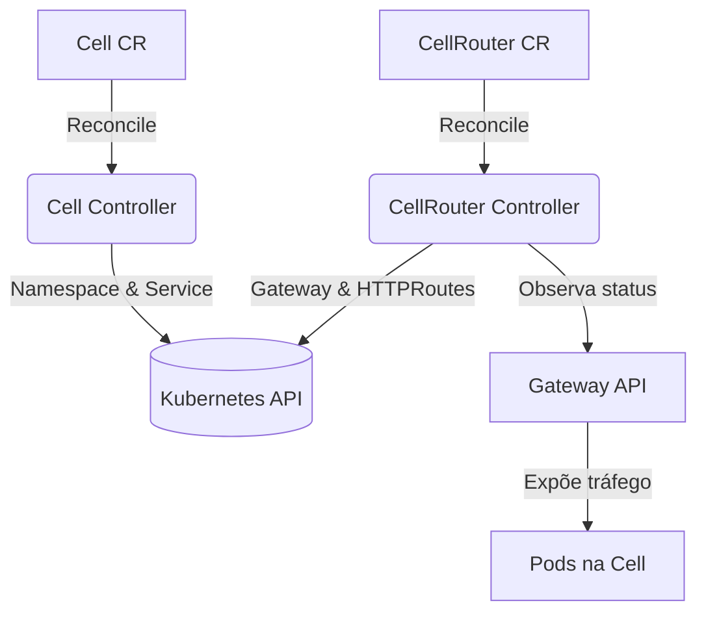
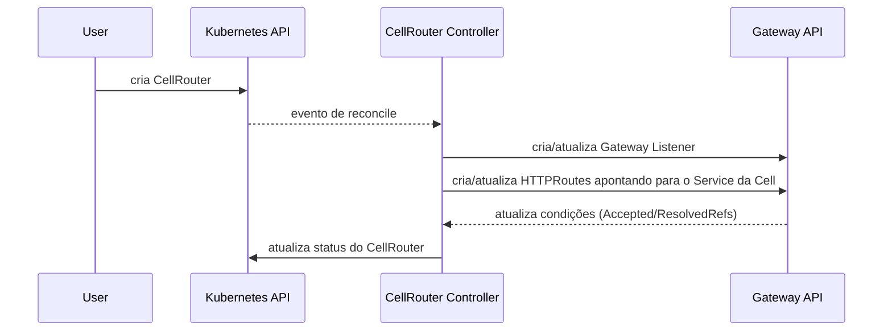

# Cell Router Operator

Operador Kubernetes escrito em Go com Kubebuilder para orquestrar componentes de uma arquitetura baseada em células. O operador cria e mantém:

- **Cells** – Namespaces isolados com serviços de entrada próprios.
- **CellRouters** – Gateways baseados no Gateway API que publicam rotas HTTP para as células.

O projeto aplica padrões de operadores (reconciliação idempotente, uso de finalizers, status rico) e princípios SOLID/Clean Code para manter o código modular.

## Visão Geral



Fluxo de reconciliação simplificado para um `CellRouter`:



## Estrutura do Projeto

- `api/v1alpha1`: Tipos das CRDs e validações.
- `internal/controller`: Reconcilers, lógica de limpeza e atualização de status.
- `internal/resource`: Builders idempotentes de Namespaces, Services, Gateways e HTTPRoutes.
- `scripts/run-local.sh`: Script único para preparar um ambiente Kind, rodar testes, construir imagem e aplicar exemplos.

## Executando Localmente com Kind

Pré-requisitos: Docker, Kind ≥ v0.20 e kubectl.

O script usa um container `golang:1.25.3`, então não depende da versão de Go instalada na máquina para o fluxo local.

```bash
# executa testes, cria cluster Kind, carrega a imagem e aplica exemplos
./scripts/run-local.sh
```

Comandos úteis após o script:

```bash
kubectl get cells
kubectl get cellrouters
kubectl get gateways -A
kubectl get httproutes -A
```

Para remover o cluster:

```bash
kind delete cluster --name cell-router
```

## Testes e Cobertura

```bash
# cobertura agregada (>80%)
go test ./api/... ./internal/... -coverprofile=coverage.out
go tool cover -func=coverage.out | tail -n1
```

A suíte atinge **≈81%** de cobertura graças a testes unitários dos reconcilers, builders e funções utilitárias.

## Recursos Customizados

### Cell

```yaml
apiVersion: cell.cellrouter.io/v1alpha1
kind: Cell
metadata:
  name: payments
spec:
  namespaceLabels:
    team: payments
  workloadSelector:
    app: payments-gateway
  serviceAnnotations:
    prometheus.io/scrape: "true"
  entrypoint:
    serviceName: payments-entry
    port: 8080
  tearDownOnDelete: true
```

### CellRouter

```yaml
apiVersion: cell.cellrouter.io/v1alpha1
kind: CellRouter
metadata:
  name: default-router
spec:
  gateway:
    name: cell-router-gateway
    namespace: cell-router-system
    gatewayClassName: eg
    listeners:
      - name: http
        port: 80
        protocol: HTTP
  routes:
    - name: payments-route
      cellRef: payments
      listenerNames:
        - http
      hostnames:
        - payments.example.com
      pathMatch:
        type: PathPrefix
        value: /payments
      headerMatches:
        - name: X-Tenant
          value: premium
      queryParamMatches:
        - name: plan
          value: gold
      weight: 1
```

## Limpeza Manual

```bash
make undeploy
kind delete cluster --name cell-router
```

## Desenvolvimento

- Executar `make install` para instalar CRDs.
- Executar `make run` para rodar o manager localmente (usa o `kubeconfig` atual).
- Atualizar CRDs após mudanças nos tipos com `make generate && make manifests`.
- Para validar ponta a ponta com Kind + Envoy Gateway, use `./scripts/run-local.sh`.

## Próximos Passos

- Adicionar testes end-to-end reais utilizando os exemplos de Gateway.
- Integrar métricas personalizadas expostas pelo controller manager.
- Automatizar lint com `golangci-lint` e checagens de segurança de imagens.
