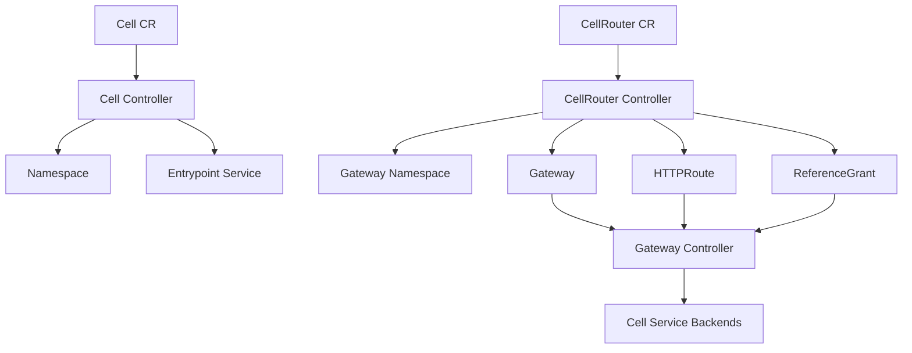

# Cell Router Operator

`cell-router-operator` is a Kubernetes operator built with Go and Kubebuilder.

It is intended as a foundation for experimenting with and operationalizing cell-based routing on Kubernetes using Gateway API primitives.

It manages two cluster-scoped custom resources:

- `Cell`: creates and maintains an isolated namespace plus an entrypoint `Service` for a workload set.
- `CellRouter`: creates and maintains a `Gateway`, `HTTPRoute` resources, and the required `ReferenceGrant` objects to route traffic to one or more cells.

The project is designed for local validation with Kind + Envoy Gateway and for extension as a foundation for cell-based platform routing.

## Cell-Based Architecture

Cell-based architecture is a bulkhead-style design approach: instead of running one large shared instance of a workload, you split the workload into multiple isolated instances called cells. Each cell serves only a subset of traffic, and failures should be contained to the cell that is currently handling the affected requests.

In the AWS Well-Architected guidance, the important properties of a cell-based architecture are:

- cells are independent workload instances
- cells should avoid sharing state with each other
- a routing layer sends requests to the correct cell
- the routing layer should stay as thin as possible
- the main goal is reducing the scope of impact when a failure, bad deployment, or poison-pill request happens

This project maps those ideas to Kubernetes in a deliberately small form:

- a `Cell` represents the workload boundary for one cell
- a `CellRouter` represents the thin routing layer in front of cells
- Gateway API resources provide the routing contract
- an external Gateway API implementation such as Envoy Gateway applies the actual proxy configuration

This repository is not a complete multi-tenant cell platform. It does not yet implement customer-to-cell placement, partition-key mapping, cell migration workflows, or a richer control plane. Instead, it provides the core Kubernetes building blocks for:

- declaring isolated cell entrypoints
- declaring routing rules that target those cells
- validating the end-to-end behavior locally

If you are new to the pattern, a useful way to think about this operator is:

- `Cell` is the per-cell service boundary
- `CellRouter` is the shared routing boundary
- the workload running behind the `Service` is the actual cell data plane
- the operator is part of the control plane that keeps those boundaries in the desired state

## What It Does

At a high level:

1. A `Cell` declares where a workload lives and how it should be exposed internally.
2. The operator creates the namespace and entrypoint `Service` for that cell.
3. A `CellRouter` declares HTTP routing rules for one or more cells.
4. The operator creates a Gateway API `Gateway` and one `HTTPRoute` per declared route.
5. Traffic is routed to the target cell service according to host, path, headers, query params, and weight.

In a more complete cell-based platform, route selection would often depend on a partition key such as tenant ID, customer ID, or resource ID. In this repository, the sample flow demonstrates the routing layer with explicit HTTP match rules so the mechanics are easy to observe locally.

## Architecture



## Requirements

For the local end-to-end flow:

- Docker
- Kind
- kubectl
- Helm

For development on the host:

- Go 1.25.3
- Kubebuilder 4.13.1

The repository already contains a scripted local flow that uses a Dockerized Go toolchain for repeatability.

## Run Locally

Use the single local script:

```bash
./scripts/run-local.sh
```

The script does the following:

1. Ensures a Kind cluster exists.
2. Installs Gateway API CRDs.
3. Installs Envoy Gateway via Helm.
4. Applies the local `GatewayClass`.
5. Runs unit tests with coverage.
6. Builds the operator image.
7. Loads the image into Kind.
8. Installs CRDs and deploys the controller.
9. Applies two sample cells: `payments` and `orders`.
10. Deploys two sample workloads.
11. Applies a sample `CellRouter`.
12. Verifies routing with real `curl` requests.

## Local Verification

The sample router exposes two routes:

- `payments.example.com` + `/payments` + header `X-Tenant: premium` + query `plan=gold` -> `payments`
- `orders.example.com` + `/orders` -> `orders`

Useful commands after the script:

```bash
kubectl get cells
kubectl get cellrouters
kubectl get gateways -A
kubectl get httproutes -A
kubectl get referencegrants -A
```

Manual verification example:

```bash
ENVOY_SERVICE=$(kubectl get svc -n envoy-gateway-system \
  --selector=gateway.envoyproxy.io/owning-gateway-namespace=cell-router-system,gateway.envoyproxy.io/owning-gateway-name=cell-router-gateway \
  -o jsonpath='{.items[0].metadata.name}')

kubectl -n envoy-gateway-system port-forward service/${ENVOY_SERVICE} 8888:80
```

In another terminal:

```bash
curl -H 'Host: payments.example.com' -H 'X-Tenant: premium' \
  'http://127.0.0.1:8888/payments?plan=gold'

curl -H 'Host: orders.example.com' \
  'http://127.0.0.1:8888/orders'
```

Expected responses:

```text
payments backend
orders backend
```

## Tests

Run the core test suite:

```bash
go test ./api/... ./internal/... -coverprofile=coverage.out
go tool cover -func=coverage.out | tail -n1
```

The current suite covers:

- API deep-copy behavior
- `Cell` reconciliation
- `CellRouter` reconciliation
- Namespace, Service, Gateway, HTTPRoute, and `ReferenceGrant` builders
- Metadata merge helpers

## Main Custom Resources

### Cell

```yaml
apiVersion: cell.cellrouter.io/v1alpha1
kind: Cell
metadata:
  name: payments
spec:
  workloadSelector:
    app: payments-gateway
  entrypoint:
    serviceName: payments-entry
    port: 8080
  tearDownOnDelete: true
```

### CellRouter

```yaml
apiVersion: cell.cellrouter.io/v1alpha1
kind: CellRouter
metadata:
  name: default-router
spec:
  gateway:
    name: cell-router-gateway
    namespace: cell-router-system
    gatewayClassName: eg
    listeners:
      - name: http
        port: 80
        protocol: HTTP
  routes:
    - name: payments-route
      cellRef: payments
      hostnames:
        - payments.example.com
      listenerNames:
        - http
      pathMatch:
        type: PathPrefix
        value: /payments
      headerMatches:
        - name: X-Tenant
          value: premium
      queryParamMatches:
        - name: plan
          value: gold
    - name: orders-route
      cellRef: orders
      hostnames:
        - orders.example.com
      listenerNames:
        - http
      pathMatch:
        type: PathPrefix
        value: /orders
```

## Repository Layout

- `api/v1alpha1`: CRD types, validation markers, status models
- `cmd/main.go`: manager bootstrap and controller wiring
- `internal/controller`: reconcilers for `Cell` and `CellRouter`
- `internal/resource`: idempotent resource builders
- `config`: CRDs, RBAC, manager manifests, samples
- `scripts/run-local.sh`: local end-to-end setup and verification

## Developer Documentation

For an internal design walkthrough, reconciliation details, extension guidance, and implementation notes, see [DEVELOPER_GUIDE.md](/Users/robisson/projetcs/golang/k8s/cell-router-operator/DEVELOPER_GUIDE.md).
